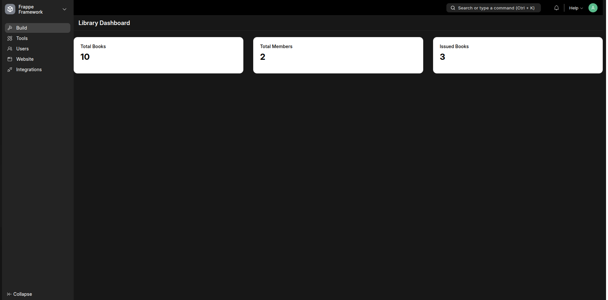

<a id="readme-top"></a>

<!-- PROJECT LOGO -->
<br />
<div align="center">
  <a href="https://github.com/Sanjaa46/library_management">
    
  </a>

  <h3 align="center">Library Management System</h3>

  <p align="center">
    Номын сангийн удирдлагын систем
    <br />
    <a href="https://github.com/Sanjaa46/library_management/blob/main/APIDocumentation.md"><strong>API documentation »</strong></a>
    <br />
    <br />
    <a href="https://github.com/Sanjaa46/library_management">View Demo</a>
    &middot;
  </p>
</div>


<!-- TABLE OF CONTENTS -->
<details>
  <summary>Агуулга</summary>
  <ol>
    <li>
      <a href="#системийн-тухай">Системийн тухай</a>
      <ul>
        <li><a href="#ашигласан-технологиуд">Ашигласан технологиуд</a></li>
      </ul>
    </li>
    <li>
      <a href="#getting-started">Getting Started</a>
      <ul>
        <li><a href="#prerequisites">Prerequisites</a></li>
        <li><a href="#суулгах">Суулгах</a></li>
      </ul>
    </li>
    <li>
        <a href="#ашиглах">Ашиглах</a>
        <ul>
            <li><a href="#номын-санч">Номын санч</a></li>
            <li><a href="#номын-сангийн-гишүүн">Номын сангийн гишүүн</a></li>
      </ul>
    </li>
    <li><a href="#acknowledgments">Acknowledgments</a></li>
  </ol>
</details>


<!-- ABOUT THE PROJECT -->
## Системийн тухай

<div align="center">
  <a href="https://github.com/Sanjaa46/library_management">
    
  </a>
</div>

Lorem Ipsum is simply dummy text of the printing and typesetting industry. Lorem Ipsum has been the industry's standard dummy text ever since the 1500s, when an unknown printer took a galley of type and scrambled it to make a type specimen book. It has survived not only five centuries, but also the leap into electronic typesetting, remaining essentially unchanged. It was popularised in the 1960s with the release of Letraset sheets containing Lorem Ipsum passages, and more recently with desktop publishing software like Aldus PageMaker including versions of Lorem Ipsum.


### Ашигласан технологиуд

[](https://frappe.io/framework)


<!-- GETTING STARTED -->
## Getting Started


### Prerequisites

[Frappe фреймворк суулгах](https://docs.frappe.io/framework/user/en/installation)

### Суулгах

1. Start the bench
    ```sh
    bench start
    ```
2. Github-аас аппаа татах
   ```sh
   bench get-app https://github.com/Sanjaa46/library_management.git
   ```
3. Dependencies суулгах
   ```sh
   bench pip install -r ./apps/library_management/requirements.txt
   ```
4. Сайт үүсгэх
   ```sh
   bench new-site <site_name>
   ```
5. Аппаа үүсгэсэн сайтдаа суулгах
   ```sh
   bench --site <site_name> install-app library_management
   ```
6. `example.site_config.json` файл дахт утгуудыг `/sites/<site_name>/site_config.json` файлд нэмнэ. Stripe key-г [Stripe](https://dashboard.stripe.com/)-д бүртгэл үүсгэн `https://dashboard.stripe.com/<account_id>/test/dashboard`-с авна
7. Migrate
    ```sh
    bench migrate
    ```
8. 'Frappe desk'-рүү нэвтрэх `http://<site_name>.localhost:8000/#login`
9. Set outgoing email in frappe desk `http://<site_name>.localhost:8000/app/email-account`

10. `Librarian` болон `Library Member` role-уудыг үүсгэж зөвшөөрлийг тохируулна


<!-- USAGE EXAMPLES -->
## Ашиглах

### Номын санч
Номийн санч системийг frappe desk-ээс ашиглана. Document үүсгэхдээ 'awesome bar'-аас үүсгэх гэж байгаа doctype-аа хайн (<doctype_name> list) шинээр үүсгэнэ.
Номын санч дараах doctype-уудыг үүсгэх эрхтэй 

* Ном үүсгэх
    1. `Artile List`>`Add Article` номын мэдээлэл оруулж хадгална

* Library Member үүсгэх
    1. `Library Member List`>`Add Library Member` хэрэглэгчийн мэдээллийг оруулж хадгална

* Гишүүнчлэл үүсгэх
    1. `Library Membership`>`Add Library Membership` 
    2.  Library Membership үүсэхэд Membership Fee цуг үүснэ. "Membership Fee"-н status-г 'Paid' болгосноор гишүүнчлэл идэвхжинэ.

* Ном зээлдэх болон буцаах
    1. `Lirbary Transaction List`>`Add Lirbary Transaction` гүйлгээний төрлийг "Issue" эсвэл "Return" гэж сонгосноос хамааран номын төлөв өөрчлөгдөнө.

### Номын сангийн гишүүн
Үйлчлүүлэгч системийг ашиглахдаа custom frontend-ээс дараах [API Documentation](https://github.com/Sanjaa46/library_management/blob/main/APIDocumentation.md)-ий дагуу ашиглана. Мөн frappe desk-ийн workflow-ийг ашиглан ном зээлэх боломжтой.

* Ном зээлэх хүсэлт гаргах
    1. `Book Request List`>`Add Book Request` зээлэх номоо сонгоно.


<!-- CONTACT -->
## Холбоо барих

Email: sanjaas880@gmail.com

Project Link: [https://github.com/Sanjaa46/library_management.git](https://github.com/Sanjaa46/library_management.git)


<!-- ACKNOWLEDGMENTS -->
## Acknowledgments

* [Frappe Framework Documenation](https://frappe.io/framework)

<p align="right">(<a href="#readme-top">back to top</a>)</p>


<!-- MARKDOWN LINKS & IMAGES -->
[product-screenshot]: images/screenshot.png

