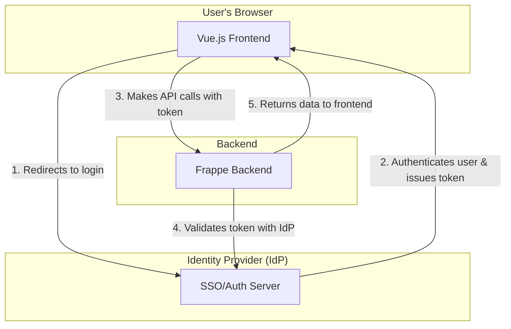

```mermaid
graph TD
    subgraph "User's Browser"
        A[Vue.js Frontend]
    end

    subgraph "Identity Provider (IdP)"
        B[SSO/Auth Server]
    end

    subgraph "Backend"
        C[Frappe Backend]
    end

    A -- "1. Redirects to login" --> B
    B -- "2. Authenticates user & issues token" --> A
    A -- "3. Makes API calls with token" --> C
    C -- "4. Validates token with IdP" --> B
    C -- "5. Returns data to frontend" --> A

```
