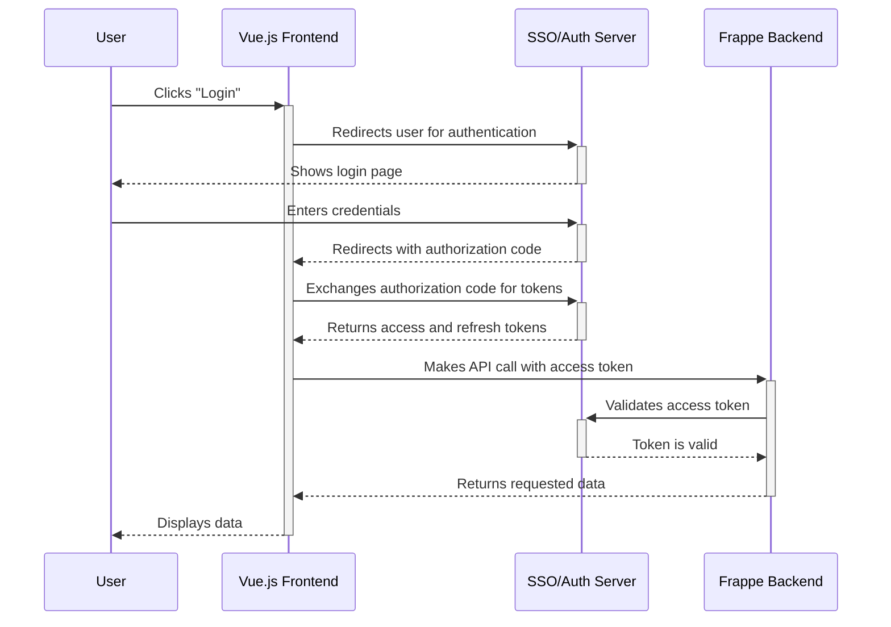

```mermaid
sequenceDiagram
    participant User
    participant VueApp as Vue.js Frontend
    participant SSOServer as SSO/Auth Server
    participant FrappeBackend as Frappe Backend

    User->>+VueApp: Clicks "Login"
    VueApp->>+SSOServer: Redirects user for authentication
    SSOServer-->>-User: Shows login page
    User->>+SSOServer: Enters credentials
    SSOServer-->>-VueApp: Redirects with authorization code
    VueApp->>+SSOServer: Exchanges authorization code for tokens
    SSOServer-->>-VueApp: Returns access and refresh tokens
    VueApp->>+FrappeBackend: Makes API call with access token
    FrappeBackend->>+SSOServer: Validates access token
    SSOServer-->>-FrappeBackend: Token is valid
    FrappeBackend-->>-VueApp: Returns requested data
    VueApp-->>-User: Displays data
```
